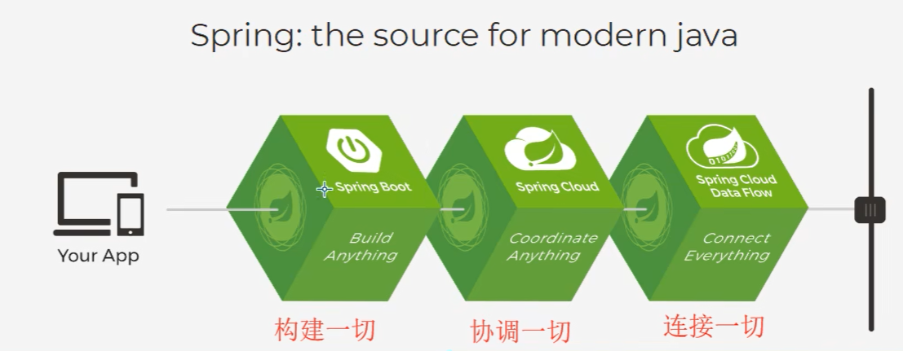

Spring前身是interface21 ，于2002年诞生。Spring1.0版本发布于2004年。

Spring的设计理念是：解决企业应用开发的复杂性。整合了现有的技术框架

SSH：Struct2 + Spring + Hibernate

SSM：SpringMvc + Spring + MyBatis

[官网](http://spring.io/projects/spring-framework#overview)

Spring是轻量级的控制反转(IOC)，面向切面编程(AOP)的框架

Spring Boot:快速开发的脚手架，基于SB可以快速开发单个微服务

Spring Cloud：基于SB实现

复习一下什么是JavaBean：

1. public无参构造
2. 且具有包结构
3. 私有属性
4. 每个属性都有其GetterSetter方法