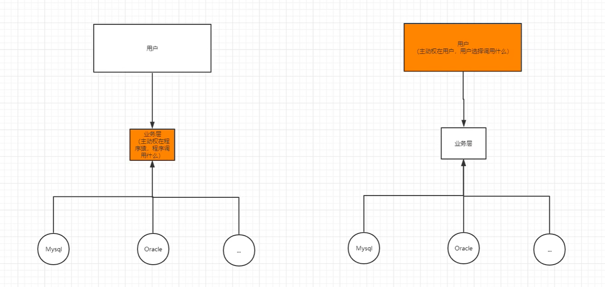
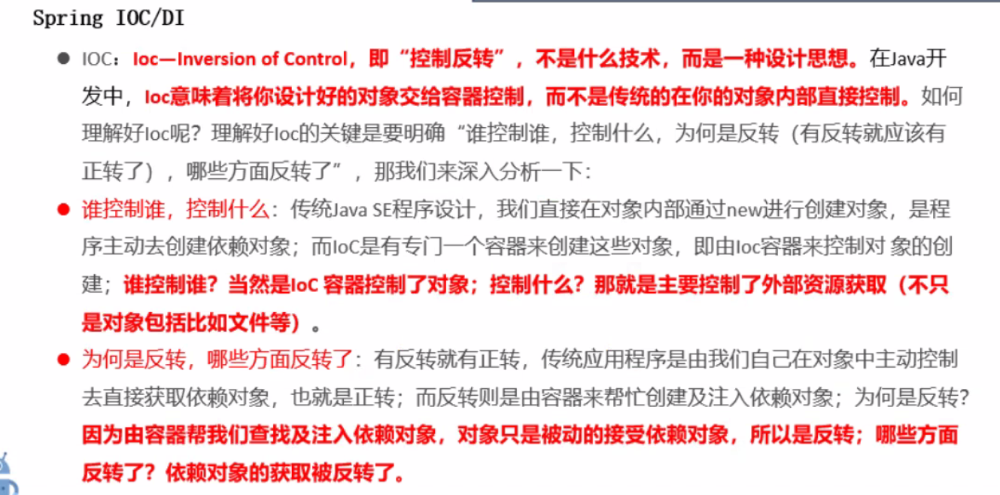

之前学习的架构是：UserDao->UserDaoImpl，UserService->UserServiceImpl

```java
public class UserServiceImpl implements UserService {

//    UserDao userDao = new UserDaoImpl(); // 这样的Dao层是写死的

    UserDao userDao;
    // 利用set进行动态注入，让调用者自由调用Dao实现
    public void setUserDao(UserDao userDao) {
        this.userDao = userDao;
    }

    @Override
    public void getUser() {
        // 实现service层的方法
    }
}

public class testMain() {
    public static void main(String[] args) {
        UserService service = new UserServiceImpl();
        // 动态注入
        service.setUserDao(new UserDaoImpl());
//        service.setUserDao(new MySQLDaoImpl());
        service.getUser();
    }
}
```

主动权发生了改变！也就是说不用管理对象的创建，让调用方决定。耦合性大大降低




控制反转是一种通过描述（XML或注解）并通过第三方去生产或获取特定对象的方式。
在Spring中实现控制反转的是IoC容器，其实现方法是依赖注入（Dependency Injection,DI）