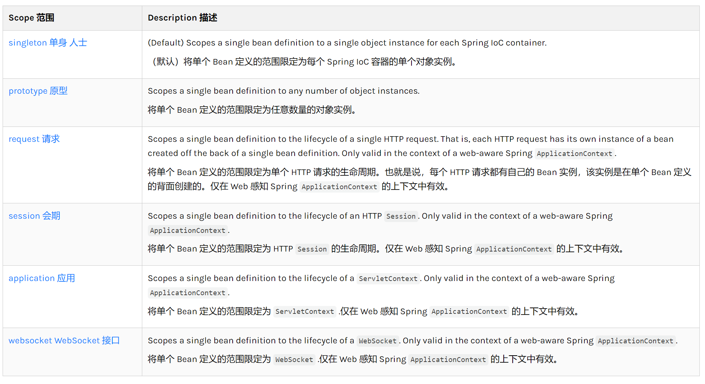

官网文档的解释



如何配置bean的作用域：给bean标签的属性scope赋相应值

Bean的作用域
- singleton（默认）：单例，全局唯一。【感觉很像static】
- prototype：原型，每次请求都会创建新的实例。【感觉像饿汉式】
- 后面都是webMVC相关的，以后再看

单例模式

饿汉式
```java
public class HungrySingleton{
    private static final HungrySingleton instance = new HungrySingleton();
    
    private HungrySingleton(){}
    
    public static Singleton getInstance(){
        return instance;
    }
}
```

懒汉式

```java
public class LazySingleton() {
    private static final LazySingleton instance = null;

    private LazySingleton() {
    }

    public static LazySingleton getInstance() {
        if(instance == null){
            instance = new LazySingleton();
        }else {
            return instance;
        }
        
        return instance;
    }
}
```