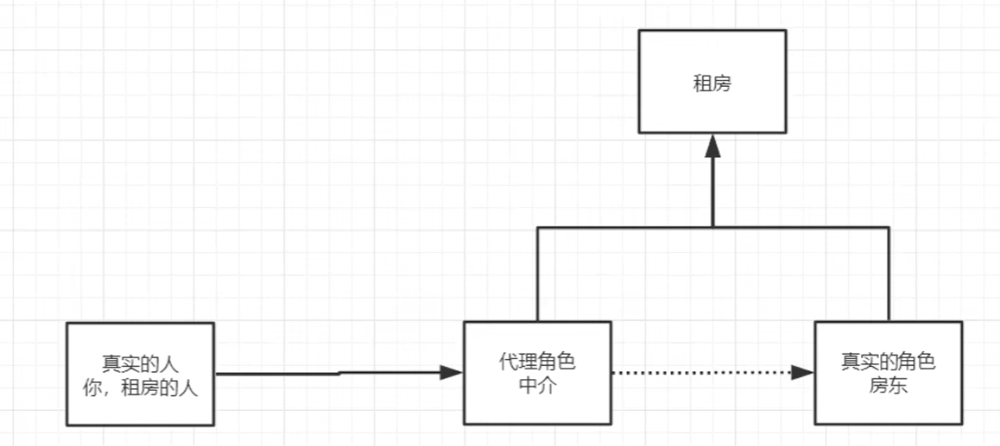

代理角色分析

- 【Rent】抽象角色：使用接口或抽象类来解决
- 【Host】真实角色：被代理的角色
- 【Proxy】代理角色：代理真实角色，代理后可以做附属操作
- 【Client】客户：访问代理对象的人

代理模式的好处：
- 使真实角色更注重自己的业务
- 公共业务交给代理角色，实现业务的分工
- 公共业务发生扩展时，方便集中管理

缺点：一个真实角色就会产生一个代理角色，代码量翻倍

见[这里](../Spring-06-ProxyModel/src/main/java/com/acn/staticProxy)