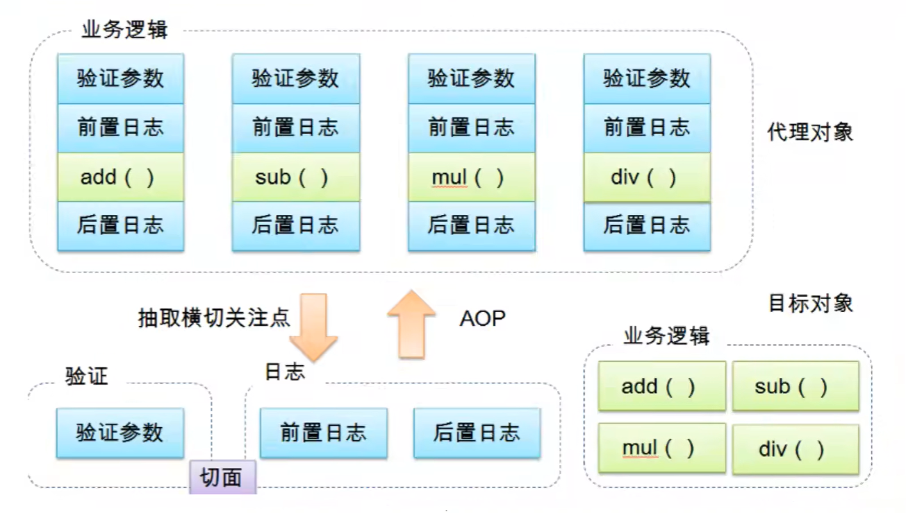

# AOP：面向切面编程
通过预编译方式和运行时动态代理实现程序功能的统一维护技术。

1. cross-cutting concern【横切关注点】：与核心业务无关的功能--->**_log中要实现的业务逻辑_**
2. aspect【切面】：横切关注点被封装的类--->**_log类_**
3. advice【通知】：切面完成的工作，即方法。在连接点上的操作--->**_log类中的方法_**
4. target【目标】：被通知的目标对象。即接口或抽象类--->**_UserService&UserServiceImpl_**
5. proxy【代理】：向目标对象应用通知后创建的对象
6. pointcut【切入点】：target被增强的方法
7. join point【连接点】：target的所有方法【可能被增强的方法】

1. Aspect（切面）—切面，是对交叉业务逻辑的统称。
2. JoinPoint（连接点）—连接点，指切面可以织入到目标对象的位置（方法，属性等）。 
3. Advice（通知）—通知，指切面的具体实现。 
4. Pointcut（切入点）—切入点，指通知应用到哪些类的哪些方法或属性之上的规则。 
5. Introduction（引入）—引入，指动态地给一个对象增加方法或属性的一种特殊的通知。 
6. Weaving（织入）—织入，指将通知插入到目标对象。 
7. Target（目标对象）—目标对象，指需要织入切面的对象。 
8. Proxy（代理对象）—代理对象，指切面织入目标对象之后形成的对象。